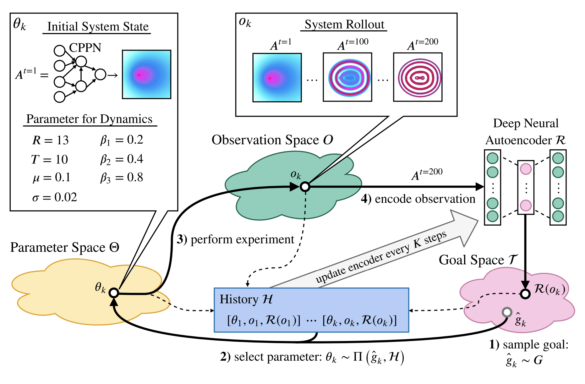

# adtool: Assisted and Automated Discovery for Complex Systems


We're pleased to introduce adtool (formerly, Automated Discovery Tool), a
package assisted and automated discovery of patterns in the exploration of
complex systems.

adtool is a software package developed in the [Inria
FLOWERS](https://flowers.inria.fr) research team which provides an integrated
solution for studying complex systems through curiosity-search methods,
consisting of a user-friendly Web UI and an extensible Python library for
user-defined experimentation systems and search algorithms.

Searching the configuration space of complex systems is often done manually,
i.e., by a human who individually identifies interesting patterns or behaviors
of the system. adtool thus assists in automating this
_exploratory phase_ of researching a new system which is theorized to be capable
of interesting, yet unknown behavior. This is the case for many projects in the
natural sciences and elsewhere. For example, physicists and chemists may use the
tool study the emergence of novel structures and materials from a physical
system, or digital artists and designers may use the tool to automatically
generate or iterate on existing designs during the creative process.

Please note that this software is currently in an **alpha stage** of
development: it is functional and has been used internally at Inria FLOWERS to
study cellular automata since 2021, but may not have features which are
convenient for different workflows. For more details on the development of
adtool, see the following [usage and technical
section](#usage-and-technical-documentation).


In the above demo, the tool is used to discover life-like propagating patterns
in a cellular automata simulation, showcasing how a researcher can specify a
series of experiments and monitor their results through both the Web UI and an
integrated Jupyter notebook.

The software was designed and maintained with contributions from Chris Reinke,
Clément Romac, Matthieu Perie, Mayalen Etcheverry, Jesse Lin, and other
collaborators in the FLOWERS team.

## Summary

### Scientific Background: Curiosity Search

The high-dimensional phase space of a complex system poses many challenges to
study. In particular, it is often desirable to explore the behavior space of
such systems for interesting behaviors without knowing a priori the precise
quantities to look for. As such, a class of algorithms based on intrinsic
motivation or "curiosity" has been proposed in [Reinke et al.,
2020](https://arxiv.org/abs/1908.06663) and extended in e.g., [Etcheverry et
al., 2020](https://arxiv.org/abs/2007.01195)  Such curiosity
algorithms enable a system to automatically generate a learning curriculum from
which it learns to explore its behavior space autonomously in search of
interesting behaviors, originally proposed in the context of robotic agents
learning to interact with their environment in an unsupervised manner, as in
[Oudeyer et al., 2007](https://ieeexplore.ieee.org/document/4141061).

In practice, dealing with such ill-posed and/or subjective search tasks requires
significant human oversight. For this reason, our adtool
proposes a software package for both :

- the implementation of such experimental pipelines for arbitrary systems and
  search methods, and
- the human-supervised exploration of such systems.

The repo comes with an existing implementation of the [Lenia
system](https://chakazul.github.io/lenia.html) which can be explored using the
curiosity search algorithms described.

### Installation

```bash
git clone https://github.com/flowersteam/adtool
cd adtool
conda create -n adtool python=3.11 -y
conda activate adtool
pip install .
```

### Examples
Various examples are provided in the `examples/` directory.
```bash
python3 run.py --config_file examples/grayscott/gray_scott.json
``` 
Available examples are:
- `examples/grayscott/gray_scott.json` - Discovering variations around a stable diffusion inference
- `examples/particlelenia/particlelenia.json` - Discovering particle lenia patterns
- `examples/flowlenia/flow_lenia_cppn.json` - Discovering flowlenia patterns initialized with CPPN
- `examples/flowlenia/flow_lenia_noise_small.json` - Discovering flowlenia patterns with restricted hardware
- `examples/flowlenia/flow_lenia_noise.json` - Discovering flowlenia patterns initialized with noise
- `examples/lenia/lenia.json` - Discovering lenia patterns
- `examples/stable_diffusion/stable_diffusion.json` - Discovering variations around a stable diffusion inference

To execute examples, you need to install required dependencies:
```bash
pip install .[examples]
```

### Reloading
To reload a previous exploration, simply run the same previous commands but from an existing discoveries directory. Previous discoveries must be generated with the same system and maps.


### Visualization
The tool provides a web interface to visualize the progression of the exploration. To start the web interface, run the following commands:
```bash
pip install .[visu]
cd examples/visu
python3 server.py --discoveries PATH_TO_DISCOVERIES
```
The web interface can be accessed at `http://127.0.0.1:8765/`.


### Short demo


### Use ADtool as a package
```bash
pip install git+https://github.com/flowersteam/adtool
```