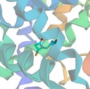
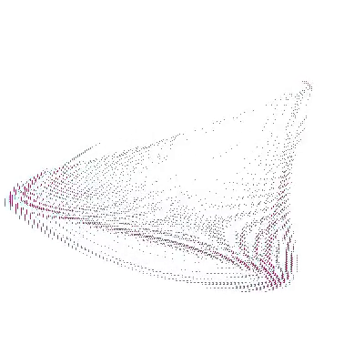
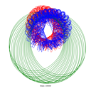
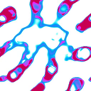
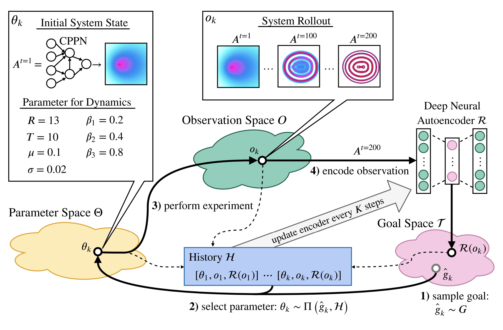

# adtool: Assisted and Automated Discovery for Complex Systems


We're pleased to introduce adtool (formerly, Automated Discovery Tool), a
package assisted and automated discovery of patterns in the exploration of
complex systems.

adtool is a software package developed in the [Inria
FLOWERS](https://flowers.inria.fr) research team which provides an integrated
solution for studying complex systems through curiosity-search methods,
consisting of a user-friendly Web UI and an extensible Python library for
user-defined experimentation systems and search algorithms.

Searching the configuration space of complex systems is often done manually,
i.e., by a human who individually identifies interesting patterns or behaviors
of the system. adtool thus assists in automating this
_exploratory phase_ of researching a new system which is theorized to be capable
of interesting, yet unknown behavior. This is the case for many projects in the
natural sciences and elsewhere. For example, physicists and chemists may use the
tool study the emergence of novel structures and materials from a physical
system, or digital artists and designers may use the tool to automatically
generate or iterate on existing designs during the creative process.

Please note that this software is currently in an **alpha stage** of
development: it is functional and has been used internally at Inria FLOWERS to
study cellular automata since 2021, but may not have features which are
convenient for different workflows.

The software was designed and maintained with contributions from Chris Reinke,
Clément Romac, Matthieu Perie, Mayalen Etcheverry, Jesse Lin, and other
collaborators in the FLOWERS team.


### Installation

```bash
git clone https://github.com/flowersteam/adtool
cd adtool
conda create -n adtool python=3.11 -y
conda activate adtool
pip install .
```


### Examples
Various examples are provided in the `examples/` directory.
```bash
python3 run.py --config_file examples/grayscott/gray_scott.json
``` 
Available examples are:
- `examples/grayscott/gray_scott.json` - Discovering Gray-Scott diffusion patterns  
  


- `examples/particlelenia/particlelenia.json` - Discovering particle lenia patterns  
  
- `examples/docking/docking.json` - Minimalist pipeline to discover docking patterns in a protein pocket, with AutoDock Gnina ( [gnina](https://github.com/gnina/gnina) )  
  
- `examples/block_ca/block.json` - Extension of single rotation block cellular automata to simulate reversible diffusion patterns  
  
- `examples/kuramoto/kuramoto.json` - 1D Kuramoto base model  
  
- `examples/nbody/nbody.json` - Discovering N-body trajectories
  
- `examples/reku/reku.json` - Discovering Rectified Kuramoto interference patterns 
- `examples/wphysics/wphysics.json` - Exploring the rule space of hypergraph rewriting systems for Wolfram Physics
- `examples/lenia/lenia_cppn.json` - Discovering lenia patterns  
  
- `examples/flowlenia/flow_lenia_noise_small.json` - Discovering flowlenia patterns with restricted hardware
- `examples/flowlenia/flow_lenia_noise.json` - Discovering flowlenia patterns initialized with noise
- `examples/flowlenia/flow_lenia_cppn.json` - Discovering flowlenia patterns initialized with CPPN  
- `examples/flashlenia/flashlenia.json` - Cuda implementation of lenia to study initial condition sensitivity
- `examples/stable_diffusion/stable_diffusion.json` - Discovering variations around a stable diffusion inference

- `examples/draft/` - Empty skeleton if you want to start from scratch

To execute examples, you need to install required dependencies:
```bash
pip install .[examples]
```
For the docking example, you need to install the `rdkit` package and download the `gnina` executable:
```bash
sudo apt install openbabel libxml2-dev libxslt-dev libopenbabel-dev swig
pip install plip --global-option=build_ext --global-option="-I/usr/local/include/openbabel3" --global-option="-L/usr/local/lib"
pip install rdkit
wget https://github.com/gnina/gnina/releases/download/v1.1/gnina -O examples/docking/systems/gnina
chmod +x examples/docking/systems/gnina
```
And also move replacements02_sa2.db downloaded here http://www.qsar4u.com/pages/crem.php to the examples/docking/maps/ directory.

### Reloading
To reload a previous exploration, simply run the same previous commands but from an existing discoveries directory. Previous discoveries must be generated with the same system and maps.


### Visualization
The tool provides a web interface to visualize the progression of the exploration. To start the web interface, run the following commands:
```bash
pip install .[visu]
cd examples/visu
python3 server.py --discoveries PATH_TO_DISCOVERIES
```
The web interface can be accessed at `http://127.0.0.1:8765/`.

### Scientific Background: Curiosity Search

The high-dimensional phase space of a complex system poses many challenges to
study. In particular, it is often desirable to explore the behavior space of
such systems for interesting behaviors without knowing a priori the precise
quantities to look for. As such, a class of algorithms based on intrinsic
motivation or "curiosity" has been proposed in [Reinke et al.,
2020](https://arxiv.org/abs/1908.06663) and extended in e.g., [Etcheverry et
al., 2020](https://arxiv.org/abs/2007.01195)  Such curiosity
algorithms enable a system to automatically generate a learning curriculum from
which it learns to explore its behavior space autonomously in search of
interesting behaviors, originally proposed in the context of robotic agents
learning to interact with their environment in an unsupervised manner, as in
[Oudeyer et al., 2007](https://ieeexplore.ieee.org/document/4141061).

In practice, dealing with such ill-posed and/or subjective search tasks requires
significant human oversight. For this reason, our adtool
proposes a software package for both :

- the implementation of such experimental pipelines for arbitrary systems and
  search methods, and
- the human-supervised exploration of such systems.

The repo comes with an existing implementation of the [Lenia
system](https://chakazul.github.io/lenia.html) which can be explored using the
curiosity search algorithms described.


### Use ADtool as a package
```bash
pip install git+https://github.com/flowersteam/adtool
```


# FAQ on the grayscott example

## How can I change the size of the simulation?
This can be done directly by changing the configuration file [here](https://github.com/flowersteam/adtool/blob/2f03270c64f19f24d539f2e4f45936ef892b5fd8/examples/grayscott/gray_scott.json#L11).

## How can I change the number of steps for each simulation?
Possibly directly from the configuration file [here](https://github.com/flowersteam/adtool/blob/2f03270c64f19f24d539f2e4f45936ef892b5fd8/examples/grayscott/gray_scott.json#L13).

## How can I load another exploration algorithm?
From the configuration file by specifying the appropriate module path and name [here](https://github.com/flowersteam/adtool/blob/2f03270c64f19f24d539f2e4f45936ef892b5fd8/examples/grayscott/gray_scott.json#L9).
Other modules for this are defined [here](https://github.com/flowersteam/adtool/tree/2f03270c64f19f24d539f2e4f45936ef892b5fd8/adtool/explorers).

## How can I change the parametric space of the simulation?
This is the 'parameter_map', introduced [here](https://github.com/flowersteam/adtool/blob/2f03270c64f19f24d539f2e4f45936ef892b5fd8/examples/grayscott/gray_scott.json#L21) in the configuration file.
For example, it's possible to copy the default file serving as parameter_map defined [here](https://github.com/flowersteam/adtool/blob/2f03270c64f19f24d539f2e4f45936ef892b5fd8/examples/grayscott/maps/GrayScottParameterMap.py), then update the path to the new parameter_map in the used configuration file [here](https://github.com/flowersteam/adtool/blob/2f03270c64f19f24d539f2e4f45936ef892b5fd8/examples/grayscott/gray_scott.json#L22).

## How can I change the statistics used to characterize the final state of the simulation?
Same logic as 'parameter_map' but with 'behavior_map' [here](https://github.com/flowersteam/adtool/blob/2f03270c64f19f24d539f2e4f45936ef892b5fd8/examples/grayscott/gray_scott.json#L21), an example of which is provided [here](https://github.com/flowersteam/adtool/blob/2f03270c64f19f24d539f2e4f45936ef892b5fd8/examples/grayscott/maps/GrayScottStatistics.py). The current statistics are only calculated on the last state of the simulation, but nothing prevents considering all previous states.

## How can I change the way the grayscott simulation operates?
For this, it's possible to start from the default system definition [here](https://github.com/flowersteam/adtool/blob/2f03270c64f19f24d539f2e4f45936ef892b5fd8/examples/grayscott/systems/GrayScott.py), make modifications in a new file, and then update the path to the new system in the configuration file [here](https://github.com/flowersteam/adtool/blob/2f03270c64f19f24d539f2e4f45936ef892b5fd8/examples/grayscott/gray_scott.json#L9).


## What is the execution flow?  
You can have a look at the [simplified execution flow](docs/execution_flow) to understand a bit more about the different steps of the exploration.

## Join the [Discord community](https://discord.gg/yc5jhYM6u5)


