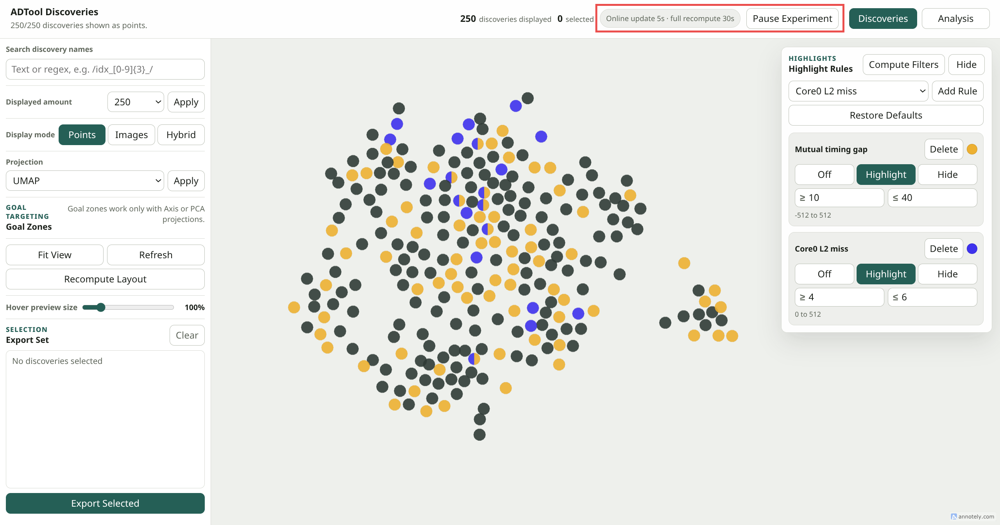
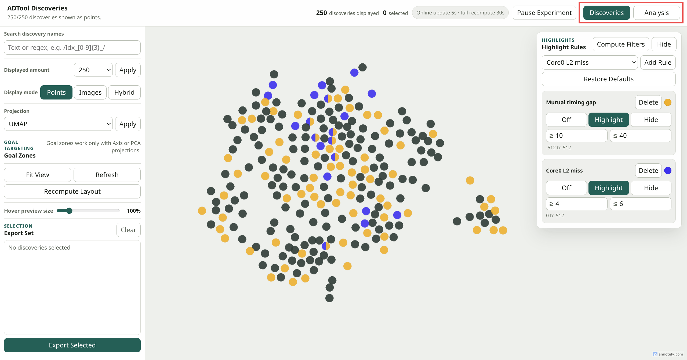
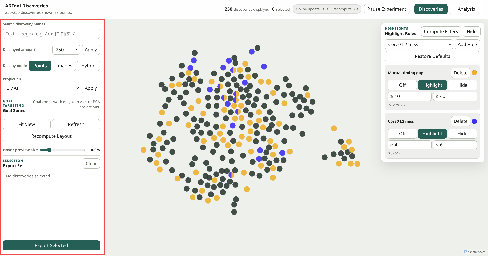
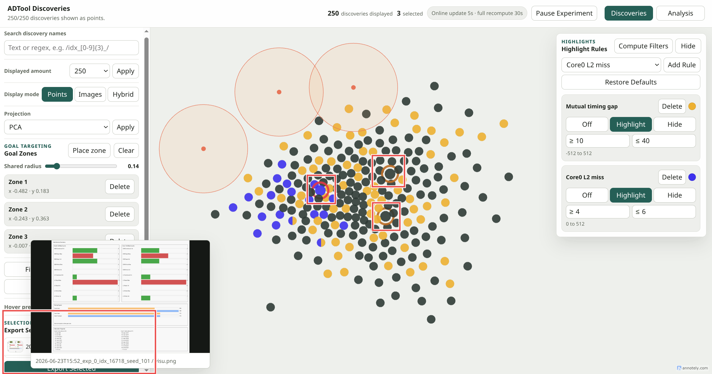
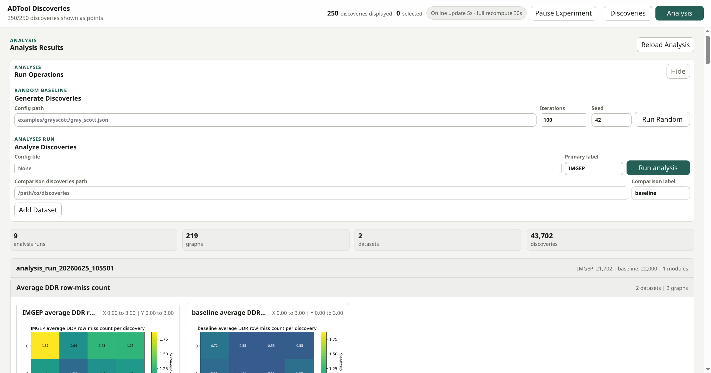
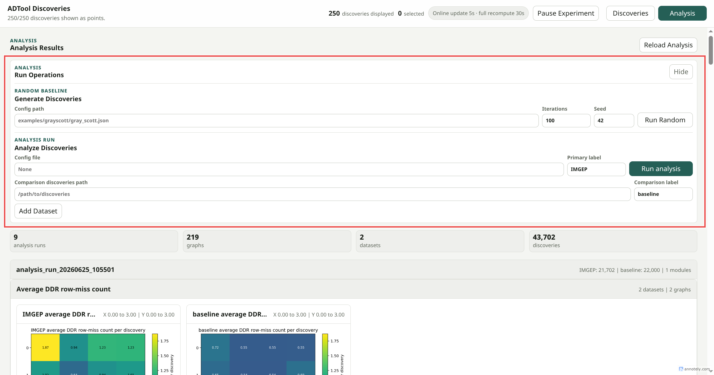
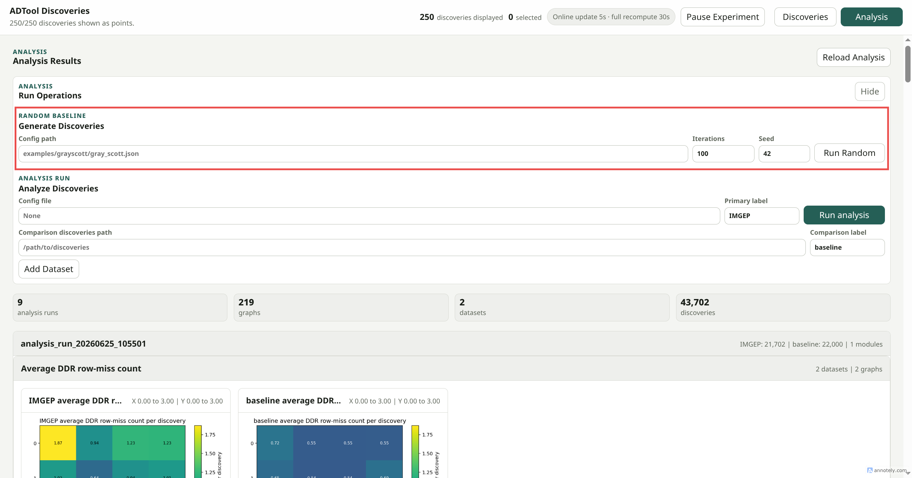
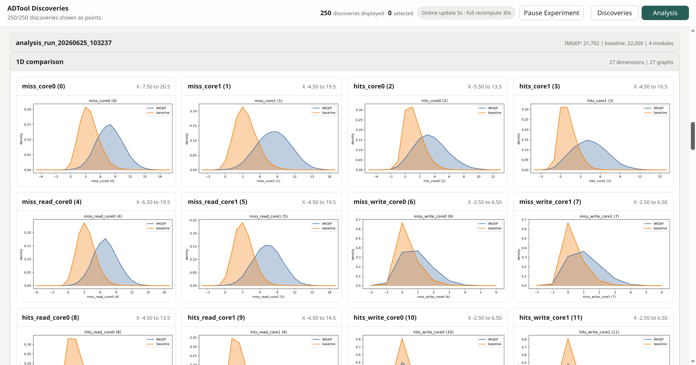

# Visualization UI Guide

This document explains everything visible in the web interface, section by section.

It is an operator guide:

- what is displayed,
- what each visible control does,
- when a section is hidden or disabled,
- where to read more for the underlying extension mechanism.

## Discovery View

## 1. Discovery Map

Map stage with discoveries and highlight dock:

### What is displayed

The discovery map is the main page of the viewer. It contains:

- the 2D discovery map,
- point or image rendering,
- the highlight dock on the right,
- the empty state when no discoveries are available.

### What the map does

- shows discoveries in 2D,
- supports hover previews,
- supports selection,
- supports projection changes,
- updates incrementally in refresh mode.

### Point behavior

- normal points show default map styling,
- highlighted points can be colored or hidden by rules,
- points matching multiple highlight rules can show multiple colors,
- selected points remain selected independently of the highlight state.

### Empty state

If no discoveries are available, the map is replaced by an empty-state message.

## 2. Top Bar

Status line:

Runtime badge and pause/resume:

Page navigation:

### What is displayed

The top bar contains the changing and interactive runtime controls:

- the status line,
- `discoveries displayed`,
- `selected`,
- the runtime status badge,
- the pause/resume button,
- the `Discoveries` and `Analysis` page tabs.

### What each control does

- `status line`
  - displays short status messages such as loading state, refresh actions, recomputation, export progress, or failures.
- `discoveries displayed`
  - shows how many discoveries are currently shown in the map.
- `selected`
  - shows how many discoveries are currently in the export set.
- runtime badge
  - shows whether the viewer is in manual mode or refresh mode.
- `Pause Experiment` / `Resume Experiment`
  - pauses or resumes a compatible live experiment.
- `Discoveries`
  - opens the discovery-map page.
- `Analysis`
  - opens the analysis page.

### Hidden or disabled states

- the pause/resume button is hidden unless the viewer runs in refresh mode.
- the runtime badge still appears in manual mode, but it reports manual update behavior.

Read more:

- [Visualization Guide](./VISUALIZATION.md)

## 3. Highlight Dock

Highlight dock and rule editing:

### What is displayed

Visible controls:

- `Compute Filters`
- `Hide` / `Show`
- rule list

Each rule row can include:

- mode control: `Off`, `Highlight`, `Hide`
- editable numeric bounds,
- color swatch and color picker,
- delete action,
- persistent default or custom rule state

### What each control does

- `Compute Filters`
  - materializes the per-discovery `filters` values required by highlight rules.
  - in refresh mode, new discoveries get their missing filters computed automatically when a highlight provider is configured.
- `Hide` / `Show`
  - collapses or expands the rule list.
- rule mode
  - `Off`: rule is ignored,
  - `Highlight`: matching points are colored,
  - `Hide`: matching points disappear from the map.
- numeric bounds
  - edit inclusive lower and upper limits.
- color swatch
  - opens the color picker for that rule.
- delete
  - removes the rule from the active rule set.

### Default and custom rules

- default rules come from the system highlight provider,
- custom rules can be added from available fields,
- deleted default rules stay deleted until restored.

### Hidden or disabled states

- if no highlight provider is configured, the whole dock is hidden.
- if a provider exists but filters are not materialized yet, only the `Compute Filters` action is useful.

Read more:

- [Visualization Guide](./VISUALIZATION.md#discovery-highlights)

## 4. Discovery Left Menu

Left-side discovery controls:

### What is displayed

The left menu groups most discovery-page controls in one vertical panel. It contains:

- search,
- displayed amount,
- display mode,
- projection,
- goal zones,
- view actions,
- hover preview size,
- export set.

### Search discovery names

Visible controls:

- `Search discovery names` input

Behavior:

- filters discoveries by name,
- accepts plain text,
- also accepts regex syntax such as `/pattern/` or `re:pattern`.

### Displayed amount

Visible controls:

- preset select,
- custom numeric input,
- `Apply`

Behavior:

- limits how many discoveries are displayed,
- helps keep the map usable for large runs,
- `Custom` reveals the numeric input.

### Display mode

Visible controls:

- `Points`
- `Images`
- `Hybrid`

Behavior:

- `Points`
  - renders point markers only.
- `Images`
  - renders the visual assets directly on the map.
- `Hybrid`
  - renders points with image stickers.

### Projection

Visible controls:

- `Projection` select
- `X axis id` input
- `Y axis id` input
- `Apply`

Available methods:

- `UMAP`
- `PCA`
- `t-SNE`
- `2 axis id`

Behavior:

- projection select
  - chooses the 2D projection method used for the map.
- axis inputs
  - choose the raw feature dimensions used when the projection method is `2 axis id`.
- `Apply`
  - stores the projection choice and refreshes the discoveries view.

Read more:

- [Visualization Guide](./VISUALIZATION.md)

### Goal zones

Visible controls when available:

- `Place zone`
- `Clear`
- `Shared radius` slider
- goal-zone list

Visible text:

- support or availability message

Behavior:

- `Place zone`
  - arms the map so a click places a new goal zone center.
- `Clear`
  - removes all current zones.
- `Shared radius`
  - changes the radius applied to placed zones.
- goal-zone list
  - lists the currently active zones.
  - if several zones are present, they act as one combined target area.

Hidden or disabled states:

- the whole goal-zone block is hidden unless the viewer is allowed to expose goal targeting.
- even when the block is visible, placement can still be unavailable if:
  - the projection is not supported,
  - the runtime layout is not ready,
  - the config does not enable goal-oriented sampling.

Read more:

- [Visualization Guide](./VISUALIZATION.md#goal-zones)

### View actions

Visible controls:

- `Fit View`
- `Refresh`
- `Recompute Layout`

Behavior:

- `Fit View`
  - recenters and rescales the map camera.
- `Refresh`
  - reloads currently exported discovery coordinates and metadata.
- `Recompute Layout`
  - asks the backend to recompute the 2D layout.

### Hover preview size

Visible controls:

- `Hover preview size`

Behavior:

- changes the size of the floating hover preview.

### Export set

Visible controls:

- selected-entry list,
- `Clear`,
- `Export Selected`

Behavior:

- selected-entry list
  - shows the discoveries currently selected from the map.
- `Clear`
  - empties the current selection.
- `Export Selected`
  - exports the selected discoveries into a new folder.

Selection behavior:

- clicking a point adds or removes it from the export set,
- selected points remain visually marked,
- selection count updates in the top bar.

### Hidden or disabled states

- `Sticker preview size` is hidden unless `Hybrid` mode is active.
- axis inputs are hidden unless the method is `2 axis id`.
- action buttons can be temporarily disabled while a backend operation is running.

## 5. Hover Preview

Hover preview and selected-point emphasis:

### What is displayed

The hover preview is a floating card outside the main panel layout.

It can display:

- an image preview,
- a video preview,
- discovery metadata text.

### What it does

- follows hovered discoveries,
- scales with `Hover preview size`,
- hides automatically when switching away from the discoveries page or when nothing is hovered.

## Analysis View

## 6. Analysis Page Controls

Analysis page header and reload control:

### What is displayed

Visible controls:

- `Reload Analysis`

### What each control does

- `Reload Analysis`
  - reloads existing analysis summaries from disk.

## 7. Analyze Discoveries

Run-operations panel:

### Random baseline

Random baseline block:

Visible controls:

- `Config path`
- `Iterations`
- `Seed`
- `Run Random`

Behavior:

- launches a random discovery generation job,
- writes discoveries that can later be analyzed.

### Analyze discoveries

Analysis-run block:

Visible controls:

- `Config file`
- `Primary label`
- `Run analysis`
- comparison dataset rows
- `Add Dataset`

Each comparison row contains:

- `Comparison discoveries path`
- `Comparison label`

Behavior:

- launches offline analysis modules on the current discoveries folder versus one or more comparison folders,
- uses the configured analysis file,
- supports multiple datasets by adding rows.

### Panel toggle

Visible control:

- `Hide` / `Show`

Behavior:

- collapses or expands the run-operations panel.

Read more:

- [Analysis Modules](./ANALYSIS_MODULES.md)

## 8. Analysis Results Grid

Rendered analysis results:

### What is displayed

Visible regions:

- global analysis statistics,
- module sections,
- image cards,
- empty-state panel when no run exists.

### What it does

- renders generated analysis modules in config order,
- groups images by module,
- opens graphs in a lightbox when clicked.

### Empty state

If no analysis run exists yet, the page shows a message explaining that a dataset path or random baseline is needed first.

## 9. Lightbox

### What is displayed

Visible controls:

- enlarged graph,
- title,
- `Close`

### What it does

- opens an analysis graph at larger size,
- closes via the close button, `Escape`, or clicking outside the image.

## Related Docs

- [Visualization Guide](./VISUALIZATION.md)
- [Analysis Modules](./ANALYSIS_MODULES.md)
